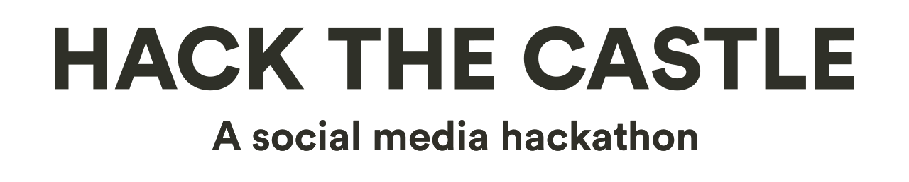
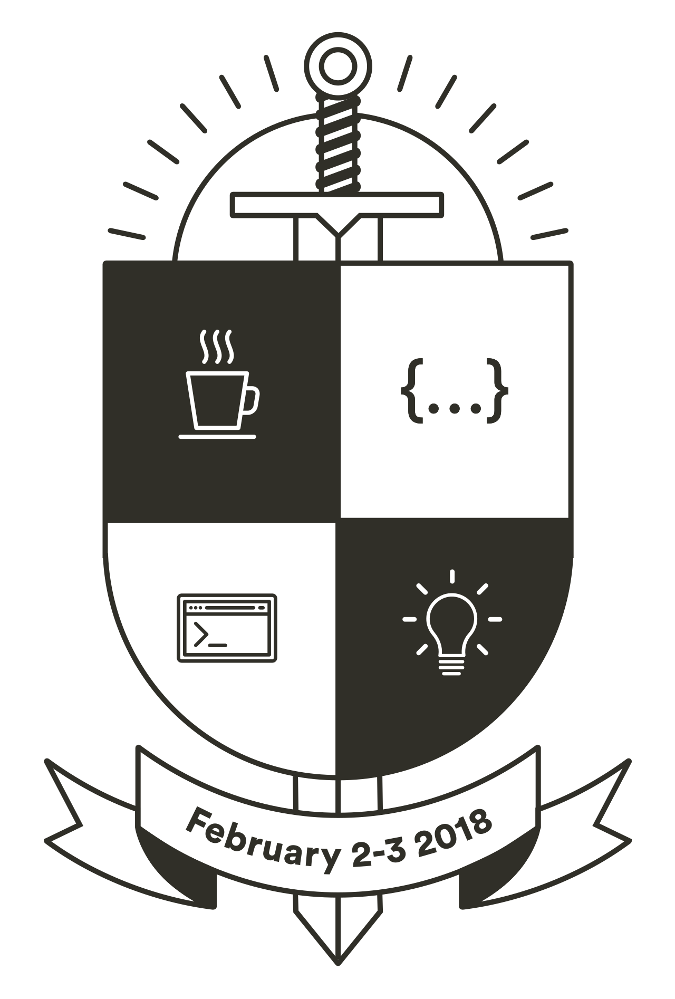

# Facebook Messenger Platform Sample (Python)
https://github.com/fbsamples/messenger-platform-samples python porting version

### Setting
```
virtualenv env
source env/bin/activate
pip install -r requirements.txt
```

### Edit config.py
```
CONFIG = {
    'FACEBOOK_TOKEN': 'YOUR_FACEBOOK_TOKEN',
    'VERIFY_TOKEN': 'YOUR_VERIFY_TOKEN',
    'SERVER_URL': 'https://YOUR_HOSTNAME'
}
```

### Run
```
python server.py

# default web server port 8080
```

<p align="center">
  <a href="http://hack.cetrez.com/"></a>
  <br />
  <a href="http://hack.cetrez.com/"></a>
</p>

[Sign up](http:/hack.cetrez.com) | [Register team](http:/hack.cetrez.com/teams) | [Chat on Slack](https://join.slack.com/t/cetrezhack2018/shared_invite/enQtMzA3MjEwMjE2NTUxLWY4NTc5N2NhMzk5M2Y5NGRiOTJlMWI3OTQ0OWI4YzI4Zjg0ZWUzZGU1NTQ2NzkxODVkNmRiNjVhODgxMmI2MGQ) | [Cetrez](http://cetrez.com/) | [digIT](http://github.com/cthit) | [ArmIT](https://chalmers.it/business/)
___
**♜ Hack the Castle** – *A social media hackathon*.
Winter hackathon at Cetrez Castle.
A collaboration with [digIT](http://github.com/cthit) and [ArmIT](https://chalmers.it/business/).

Use this repository as a starting point by forking it and start working.
We will use the fork-tree to keep track of contestants.

## ♜ Rules
The most important thing is to have fun, if you are unsure about the rules don't
hesitate to ask us.
- Every project must be a fork of the [hackathon repository](https://github.com/cetrez/Hack-the-Castle-2018)
- No project can have been started prior to the hackathon, but you are welcome
to use existing frameworks, libraries, boilerplates, etc.
- The allowed groups size is 2 to 4 contestants
- The last commit for the project shall be pushed to [github](https://github.com)
before Saturday 18:00
- Fill out the TEAM.md with your team and project information, then move it to
`README.md`

### Recommendations
- Use libraries and frameworks
- Make sure the team have an initial idea on Friday
- We are here to help you, and so are [StackOverflow](https://stackoverflow.com)
- Take breaks, have fun
- Include everyone in the teamwork


### Criteria
The projects are evaluated on four main criteria.
- Business value
- Design & UX
- Technical Quality
- Wow-factor

## ♜ Days & times
Some more informal activities not in the schedule below may be added during the
hackathon.

|Time  | Activity                       |
|---   | ---                            |
|**Friday**    |  **Meetup**            |
|18:00 | Meetup opens                   |
|18:30 | Hack the Castle Introduction   |
|19:30 | Mingle, team forming           |
|**Saturday**  |  **Hackathon**         |
|08:00 | Castle doors open              |
|08:00 - 09:00 | Breakfast              |
|10:00 | Inspirational seminar – *Create a great project* |
|12:00 | Lunch with Cetrez presentation |
|14:00 – 17:00 | Mario Kart Tournament  |
|18:00 | Last commit must be pushed     |
|20:00 | Winners are announced          |
|20:30 ~ 23:00 | After Hack party       |

## ♜ Links & inspiration
A collection of useful links, you may of course use any other API you'd like.

### Social media API's
- [Facebook](https://developers.facebook.com/)
- [Twitter](https://developer.twitter.com/)
- [Instagram](https://www.instagram.com/developer/)
- [Pinterest](https://developers.pinterest.com/)
- [reddit](https://www.reddit.com/dev/api)
- [Tumblr](https://www.tumblr.com/docs/en/api/v2)
- [Youtube](https://developers.google.com/youtube/)
- [Goodreads](https://www.goodreads.com/api)
- [Meetup](https://www.meetup.com/meetup_api/auth/)
- [Spotify](https://beta.developer.spotify.com/documentation/web-api/)
- [Discord](https://discordapp.com/developers/docs/intro)
- [Keybase](https://keybase.io/docs/api/1.0)
- [Alexa Skills Kit](https://developer.amazon.com/alexa-skills-kit)

### Tools & services
- [Dialogflow, Build natural and rich conversational experiences](https://dialogflow.com/)
- [ChatFuel, Build a Facebook bot without coding](https://chatfuel.com/)
- [wit.ai, Turn what your users say into actions](https://wit.ai/)
- [Localtunnel, Expose your computer to the internet](https://localtunnel.github.io/www/)

### Frameworks & libraries
Some suggestions for frameworks and libraries to use, you may of course use
anything you like.

#### Python
- [Rasa, natural language machine learning framework](https://rasa.com/)
- [Flask, Web micro framework](http://flask.pocoo.org/)
- [Flask-Ask, Alexa skills framework](https://github.com/johnwheeler/flask-ask/)
- [Django, Web framework](https://www.djangoproject.com/)
- [Hug, Web API framework](http://www.hug.rest/)
- [Requests: HTTP for Humans](http://docs.python-requests.org/en/master/)
- [Responses](https://github.com/getsentry/responses)
- [Beautiful Soup](https://www.crummy.com/software/BeautifulSoup/)
- [Scrapy](https://scrapy.org/)
- [SQLAlchemy](http://www.sqlalchemy.org/)
- [Natural Language Toolkit](http://www.nltk.org/)

#### JavaScript
- [Botkit](https://www.botkit.ai/)
- [Hapi.js](https://hapijs.com/)
- [Socket.io](https://socket.io/)
- [Express.js](https://expressjs.com/)
- [Electron](https://electronjs.org/)
- [React](https://reactjs.org/)
- [React Native](https://facebook.github.io/react-native/)
- [react-native-arkit](https://github.com/HippoAR/react-native-arkit)
- [AR.js](https://github.com/jeromeetienne/AR.js)
- [A-Frame](https://aframe.io/)
- [Moment.js](http://momentjs.com/)
- [SuperAgent](https://visionmedia.github.io/superagent/)
